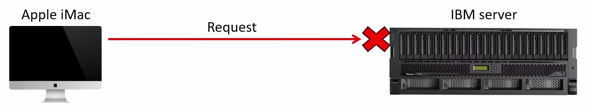

# Day 3

# Protocol

Protocol is a set of logical rules defining how data should be communicated between network devices or software to each other.

> The “Languages” that digital devices use to communicate with each other.
> 

Protocol developed by a specific vendor (e.g., IBM) to be used with their own products.

So, two different vendors specific devices can’t communicate between each other.

Like Apple iMac can’t communicate with IBM server

To solve this issue, today’s network connected to them a standard **vendor-neutral** protocols and technologies

> A standard is an agreed-upon specification that describes how a protocol o technology should work
> 

> **Vendor-neutral** standards means, devices of all types can communicate with each other.
> 

Example:

- Apple iMac can access a website hosted on different vendors web-server running Linux.
- PC running Windows can send email that can be read on a smartphone running Android. In this case, PC is different vendor, Windows is different vendor, Email is different vendor, Smartphone is different vendor and Android is different vendor.

---

# TCP/IP

## A bit history

In began of todays internet 1960’s, US Department of Defense’s ARPA (Advanced Research Projects Agency) funded ARPANET.

And It came online in 1969 to connects mainframe computers at universities and labs.

> ARPANET protocol used NCP (Network Control Program)
> 

In 1974 **Vint Cerf** and **Bob Kahn** (Fathers of Modern Internet who working on DARPA) began developing TCP or Transmission Control Program.

TCP later divided into two protocols still used today:

1. Transmission Control Protocol (TCP). (Program —> Protocol)
2. Internet Protocol (IP)

two protocols from the foundation of the protocol suite known as TCP/IP today.

- TCP/IP is vendor-proprietary solutions at that time
- Open standards that any vendor can implement
- It could run over many different types of networks.

> ARPANET fully switched to TCP/IP on January 1, 1983.
> 

---

## Who defines the standards?

Most networking standards are developed by independent standards organizations, not by a single vendor, with participation from engineers at many companies.

According to network there are two most common vendor in there,

- IEEE (Institute of Electrical and Electronic Engineers)
    
    Develops many of the technologies used on Local Area Network (LAN) such as:
    
    - Ethernet (802.3)
    - Wi-Fi (802.11)
    
    These standards includes physical specifications like Ethernet Cable types, Wi-Fi radio frequency and how to transmit signals over the physical medium weather a cable or a radio wave.
    
    They also specifies how to format messages to send another messages over the medium.
    
- IETF (Internet Engineering Task Force)
    
    Open community that defines protocols used on the internet:
    
    - TCP, IP, UDP, HTTP, DNS, etc.
    
    IETF published standards in documents called RFCs (Requests for Comments) which available free on Internet. 
    

> IEEE or IETF creates the standards and vendors like Cisco Implement them for so that devices from different companies can work together.
> 

there are many different standards and protocols. Each solving a different part of the overall communication problem. To sense of them it helps to group their jobs into layers, making a layered model.

---

## Layered Models

Networks do a lot of difference jobs to move data one computer to another computer

- Physical Transmission of signals, Local Delivery on a LAN, Routing traffic between networks, End-to-end conversations, applications, etc.

A model lets us group related jobs into layers.

- Each layer has a specific role.
- Each layer uses the services of the layer below and provides services to the layer above

Protocols live (Mostly) at one layer.

- Examples later: IP, TCP, HTTP, etc.
- Together they from a stack of protocols that work as a team (The network stack)

The model is a description, not a law.

- Different textbooks/courses use slightly different models (4-layer, 5-layer, etc.)

---

### Sending Letter analogy

Each layer had is own job,

Layers work together to deliver the message, but each one focuses on its own task.

1. Content Layer —> Focuses on the actual content of the letter and that doesn’t change at the journey.
2. Recipient Layer —> Focuses on individual person who should receive that letter and also remain that start to finish
3. Address Layer —> Focuses on the address of the house or building which should be delivered, and that stays the same as well.
4. Local Delivery Layer —> Focuses on getting the letter to the next of in the route: Post office A, Post Office B and finally Bob’s house.
5. Infrastructure Layer —> This is the system of reads and mail trucks that the delivery process relies on.

What happens inside one layer doesn’t change the job of the other layers.

- Changing the content of the letter doesn’t change the delivery steps.
- Changing the delivery path doesn’t affect the letter itself.

---

## Analogy to TCP/IP Model compare

---

## TCP/IP layer Detailed

### Application Layer (5)

Protocols for communication between application process; create and interpret data

- usually called layer 7 (Combination of OSI model Application, Presentation, Session).
- Defines how application processes format, send, and interpret data.
- When Chrome on PC1 send a request to the web server process on SRV1. It uses on application layer protocol such as HTTP to format and send the message, and that same protocol tells web server how to interpret the message it receives.
- Protocols at this layer define message formats and rules for specific task, such as:
    - For browsing web pages (HTTP/HTTPS)
    - For File Transfer (FTP/TFTP)
    - For email sending/receiving (SMTP, POP3, IMAP)
- Network infrastructure devices (routers, switches) don’t care about application-layer details.
    - They just move messages across the network
    - Only the communicating hosts interpret the data.

---

### Transport Layer (4)

Provide end-to-end communication between application processes using port number.

- Its according to port number.
- If SRV1 receives a message, It needs a way know which of these services should receive the message.
    
    This can also be called process-to-process or service-to-service communication
    
- This layer uses port number to identify the process running on host such as 80 for the webserver, 21 for the file server perhaps other services
- When the web client on PC1 wants to send a request to the web server running on SRV1 it addresses the message to port 80.
    
    
    
- And if PC1 wanted to access to access the file server instead it would address its message to port 21.
    
    
    
- The transport layer allows host to differentiate between these different streams of data.
- Layer 4 runs mainly on the communicating hosts (PC1 and SRV1); routers normally operate based on IP (Layer 3), not on Transport Layer information.
- Layer 4 primarily a conversation between the two communicating host.
- Protocol at this layer:
    - TCP (Transmission Control Protocol)
    - UDP (User Datagram Protocol)

---

### Internet Layer (3)

Provide end-to-end communication between application hosts across networks using IP address and routers.

- End-to-end delivery between host across multiple networks
- We call it end-to-end because it focuses on getting message from the source host all the way to final destination host instead of worrying about each individual hop in the middle.
- Remember, Internet means internetwork (Between Networks)
- This layer uses IP address to identify host in network.
    
    Example:  SRV1 has IP address 10.1.1.1. So when PC1 want to send message on SRV1, it addresses the message SRV1’s IP address.
    
    
    
- Routers operates mainly at this layer, using the message’s destination IP address to forward the message toward its final destination host.
- Protocol at this layer:
    - IP (IPv4, IPv6)
    - ICMP (Internet Control Message Protocol)

---

### Local Network Layer (2)

Provides hop-to-hop delivery within a local network using MAC address and switches.

- A hop is one step along the path between two devices:
    - From one router to host, to the next router or host in the path.
        
        The first hop PC1 —> R1, second hop R1 —> R2, third hop R1 —> SRV1. So basically there are three hops.
        
    - Switches don’t count hops: switch just extends the local networks, allowing multiple device to connect
        
        
        
        Switches allow them all to connect a same Local Area Network
        
    - This layer uses MAC (Media Access Control) to Identify interfaces.
    - Each device connected to a LAN has a unique MAC addresses for that specific interface.
    - Since R1 and R2 have multiple interfaces connected to network.
        
        
        
        Lets add some interfaces Gigabit Ethernet 1 for G1 and Gigabit Ethernet 2 for G2. It means these interfaces operate at a speed of 1 gigabit per second.
        
        - PC1 Sends the message to the MAC address of R1’s G1 interface (NIC). (That’s the interface that will receive PC1’s message)
        - R1 send the message to MAC address of R2’s G1 Interface (NIC).
        - R2 send the message to the MAC address of SRV1’s Interface.
        
        Protocols at this layer include:
        
        - Ethernet (IEEE 802.3)
        - Wifi (IEEE 802.11)

---

### Physical Layer (1)

sends bit as electrical, optical or radio signals, over the physical medium.

- The Physical layer (Layer 1) sends and receives bit as electrical, optical, or radio signals over the medium.
- Defines things like cables, connectors, signal levels, and link speeds.
- Examples: Copper UTP cables, Fiber-Optic cables, Wi-Fi radios and antennas, Network Interface Cards (NICs).
- The physical aspects of transmitting data are very complex. Network engineers typically don’t have to know low-level details.

---

## Encapsulation and Decapsulation

#### Encapsulation process

1. First the application layer prepares for data to be sent over the network. For example on HTTP request that Chrome on PC1 sends to a webserver running on SRV1.
    
    
    
    As the message down the stack, each layer encapsulates the data with a header including the information needed for that layer
    
    - Source and destination addresses (port number, IP addresses, MAC addresses) etc.
2. **Transport layer** encapsulates the data with its header.
    
    
    
    - The layer 4 header, source and destination port numbers and other information
3. Then the Internet Layer adds its header with source and destination IP addresses.
    
    
    
4. Then the Layer 2 Encapsulates the data with both a header and trailer. The trailer is used by the receiving device to check for transmission error.
    
    
    
5. Finally Physical layer Transmits the bits as signal over the physical medium. Which is the ethernet cable in this case.
    
    
    
    - Layer 2 Header is transmitted first, and the Layer 2 trailer transmitted last.

#### Decapsulation Process

1. The receiving device receives the message as stream of bits at Layer 1. Layer 1 simply passes those bit up to next layer.
    
    
    
2. The device examines the information in the layer 2 header and trailer, then removes them. (decapsulation or En-decapculation)
    
    
    
    - The decapsulation process is continuous up the stack: Layer 3 removes L3 header, then Layer 4 removes the L4 header, and then the data is delivered to application layer.
    - The application processes the data an if needed, generates a response that goes down the stack.
    
    
    
    ---
    

#### at Encapsulation Stage in layer 4

- When Layer 4 header added on main data, for TCP it’s called Segment and for UDP it’s called Datagram.

#### at Encapsulation Stage in layer 3

- When a Layer 3 header (L3 header) is added to this Segment or Datagram, the entire unit is referred to as a **Packet**.

#### at Encapsulation Stage in layer 2

- The combination of a **Packet** and L2 header/trailer is called frame.

#### PDU (Protocol Data Unit)

This is what is actually sent over the wire. You will never see a packet, segment, datagram traveling over the wire itself; They are always sent logically inside a frame. 

We can use also alternative names to describe the message at each stage using the term **Protocol Data Unit**. 

> **PDU is the the specific form or name of Data, that takes at each layer of the OSI model.**
> 
- The segment of datagram is Layer 4 PDU (L4PDU)
    
    
    
- A packet is a Layer 3 PDU (L3PDU)
    
    
    
- A frame is a Layer 2 PDU (L2PDU)
    
    
    

### Payload

The contents of each PDU (Everything encapsulated by that layer’s header/trailer called **Payload.**

> Payload is what’s inside the PDU. Not including Header/Trailer.
> 
- A segment of datagram’s payload is the application data.
    
    
    
- A packet’s payload is segment or datagram.
    
    
    
- A frame’s payload is a packet.
    
    
    

---

## Adjacent-layer interaction

Each layer provides service to layer above it. and Serviced by layer below it.

- **Layer 4** provides service to **Layer 5** (delivering data to the correct application using port number.
- Layer 3 provides service to Layer 4 (delivering segments/datagrams to the correct destination host using IP addresses.
- Layer 2 provides service to Layer 3 (delivering packets to next hop using MAC addresses.
- Layer 1 provides service to layer 2 (sending and receiving frames as electrical, optical, radio signals)

---

- Each layer communicates with the same layer on other devices (Same-Layer Interaction)
- The Application layer on one host sends data to Application layer on the other host
- The segment/datagram is addressed to the layer 4 port number of the correct application on the destination host.
- A packet is addressed to the layer 3 IP address of the destination host.
- A frame is addressed to the Layer 2 MAC address of the next hop
- Signals sent out of physical port are received by a physical port on the connected device.

---

## The OSI model

- TCP/IP developed started in the 1970’s (ARPANET work, early TCP/IP specs)
- In the late 1970’s and 1980’s the ISO designed 7 layer OSI model and matching protocol suite.
- The goal was to create international, vendor, neutral networking standards that could unify existing proprietary stacks and potentially replace TCP/IP.

- Governments including the US, promoted OSI as the preferred/recommended stack for new deployments.
- OSI protocol ended up being late and complex, and never gained the deployment as TCP/IP
- TCP/IP “won” in the real world, although some OSI technologies are still used.

Today’s almost all real networks used TCP/IP, but the 7 layer of OSI model survives as reference/teaching model and a common way to talk about “layers”.

---

## Other Versions

- Recommended to learn or focus 5 layer TCP/IP and 7 Layer OSI model

> On CCNA, Most question will about Layer 2 and Layer 3 also combined routing and switching.
> 

---

## Key concepts

#### TCP/IP

- TCP/IP model itself, general purpose of each of these layer.

#### Encapsulation/Decapsulation

- In encapsulation, sending host adds header and trailer to the data to prepare for it for transmission over the physical medium.
- In decapsulation, the receiving host removes the headers and trailer layer by layer until it gets to the data inside.

#### PDU (Protocol Data unit)

PDU is the the specific form or name of Data, that takes at each layer of the OSI model.

- Layer 4 PDU is a called Segment(TCP)/Datagram(UDP)
- Layer 3 PDU is called Packet.
- Layer 2 PDU is called Frame.

- The frame was actually transmitted over the physical medium in binary.

### Adjacent-Layer Interaction and Same-Layer Interaction

These concepts describe how different layers work together within each host and with their counterparts on the other devices to achieve communication between applications over a network. 

---

> ⚠️ Don’t need to remember every example or historical details. Important think is know the layers , there general roles, how they works, Encapsulation and decapsulation, idea of PDU, payload and layer interaction.
> 

> ⚠️ This is just a model not a rule. Model is helps to think about just what’s happening in the network.
> 

---