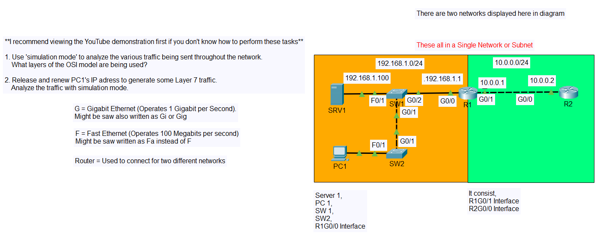

# Day 03 (OSI Model Lab)

---

- Switch 2 —> PC1 ❌, Switch 2 —> Switch 1 ✅

- Switch 1 —> Server 1 ❌, Switch 1 —> Router 1 ✅

---

## STP

- STP = Spanning Tree Protocol
- A Layer 2 protocol
- Only have Layer 2 and Layer 1 Information

- Focus on Layer 2 header or click on it.

- This is IEEE 802.3 is a standard number of Ethernet, so this is an ethernet Layer 2 Header.
- The device encapsulates the PDU into and Ethernet frame. So, there's the encapsulation process

Lets look at the Layer 1 info, 

- There are two interfaces that it sends the frame out of.
- Information like physical ports or interfaces, on a device are Layer 1 information, because It is the physical layer.

---

## OSPF

- OSPF = Open Shortest Path First
- Layer 3 protocol
- OSPF have Layer 3, Layer 2, Layer 1 Information.

Used to discover the best paths in different networks.

Let’s focus it,

There is Source IP and Destination IP

- IP address always Layer 3 Information

---

## DHCP

- DHCP = Dynamic Host Configuration Protocol
- Layer 7 protocol

PC1 using a protocol named DHCP to automatically receive an IP address. To generate some DHCP traffic, and DHCP is an Layer 7 Protocol. I’ill get PC1 to release it’s current IP address, and then renew it.

- Click on PC1 —> Desktop —> Command Prompt

type, `ipconfig` , it can show the current IP address in here which is `192.168.1.10`

let’s release this IP address by typing `ipconfig /release` and also focus on simulation

Now let’s type `ipconfig /renew` and lets check on of DHCP messages

Notice that there all the layer have Information except Layer 5 and 6. That’s because in the TCP/IP model, which is the model actually in use, Layer 5,6 and 7 are all combined into a single layer called Application Layer. Layer 5 and 6 can be consider as the part of Application Layer or Layer 7 information. 

If click on Layer 4

Layer 4 PDU is called segment.