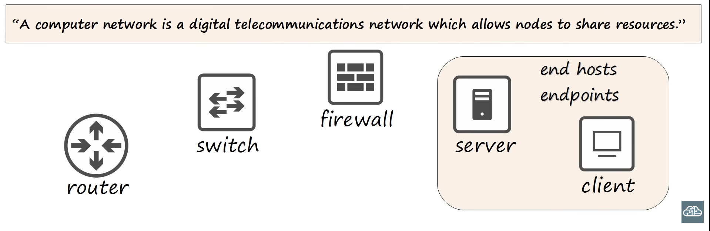

# Day 1

[Free CCNA | Network Devices | Day 1 | CCNA 200-301 Complete Course](https://youtu.be/H8W9oMNSuwo?si=pJY6wYNqUtZwh63q)

## Nodes

Two PC’s connects together actually makes a network. 
So these are two nodes that are connected to each other and they can share resources and can make conversation to each other.

## Client

Client basically Can be Desktop, Laptop, Mobile Device, Mac.

## Server

## Relationship of Client and Server

  • Client Requesting for Resource or Service
  • Server provides that Resource or Service

However, Youtube doesn’t send the data all at once. It sends the stream of data until watched the whole vide.

Same device can be a client in some situations, and a server in other situations.

## Switch

Switches used to forward traffic in a LAN (Local Area Network0 

Cisco Catalyst Switch

  • in Switch1 PC1, PC2, Printer, Desktop all are them connected through of Switch in a Local Area Network 
  • Same goes for Switch2.
  • There are two different LAN.

Switch can not connect to directly on Internet or can not send data between two different LAN

## More things about switches

Catalyst switches are cisco’s enterprise grade switches which used by enterprise level to connect their LAN’s

- Switches have many network interfaces/ports for end host to connect to (usually 24 or more)
- Provide connectivity to hosts within the same LAN (Local Area Network)

## Router

Router is device which connects two different LAN’s. Two different LAN’s can be communicate through of each other via a Router.

## How the workflow actually works

- PC1 wants a file on Tokyo Branch of SRV1 then the request will send through it to R1 via SW1
- Then it will forward to the Internet to R2
- Then it will forward to SRV1 via SW2.

- The reply also follow the reverse path back to PC1

## Characteristics of Router.

Enterprise grade cisco routers

- Routers have fewer network interfaces than switches
- provides connectivity between LAN’s.
- Therefore used to send data over the internet.
- Also provides some basic security features

## Firewalls

Firewall is a basic network security devices that control network traffic entering and exiting on the network

Firewall could be placed
  • Outside of network or LAN (FW1)
  • Inside of network or LAN (FW2)

- when PC2 wants to get a file or communicate through another LAN of SRV1 then firewall should permit the traffic through.
- The return traffic from SRV1 to PC1 should be allowed as well.

- However attacker wants to access anything inside of networks then firewall should be block it.

## Some of Cisco Firewalls

- ASA (Adapted Security Appliance) is cisco classic firewalls
- Modern ASA’s have modern features like Next Generations Firewalls including IPS, .

## Some Characteristics of Firewall

- monitor and control network traffic based on configured rules.
- Rules like which traffic should be allowed or not.
- Can be placed inside of network or outside of network.
- Firewall known as ‘Next-Generation Firewalls’ which include more modern features and filtering capabilities.

## Firewalls types

- Network Firewalls
    
    hardware devices that filter traffic between networks
    
- Host-based Firewalls
    
    software application that filter traffic entering and exiting a host machine, like a PC.
    

---

## Quiz

Question 01:

Question 02:

Question 03:

Question 04:

Question 05:

