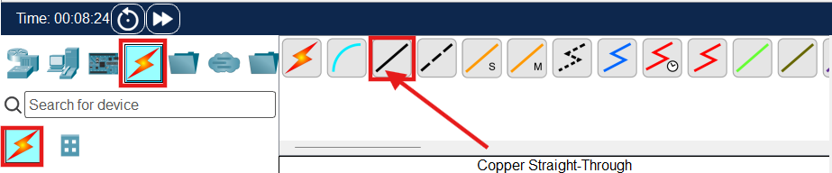

# CCNA Day2 Lab

- This lab is auto MDIX is disabled.

For UTP cable,

- PC Transmit data on Pin-1,2
- Receives data on Pin-3,4

For Switches is the opposite,

- Switch Transmit data on Pin-3,6
- Switch Receive data on Pin-1,2

So according to this lab 

- Connect all of these PC’s as well as Server1 to switches.
- Using Copper Straight Through Cable

- PC1 (FastEthernet0) —> Switch3 (FastEthernet0/1)
- 0/1 —> module/slot

| PC1 (FastEthernet0) —> | Switch3 (FastEthernet0/1) |
| --- | --- |
| PC1 (FastEthernet0) is NIC (Network Interface Card) where LAN connects. | Switch3 (FastEthernet0/1,  FastEthernet1/1, FastEthernet2/1…) These are the data ports of switches. In real world these ports are also known as RJ45 ports. |

| Standard | Speed |
| --- | --- |
| Ethernet | 10 Mbps |
| FastEthernet | 100 Mbps |
| GigabitEthernet | 1000 Mbps (= 1 Gbps) |
| 10GigabitEthernet | 10,000 Mbps (= 10 Gbps) |

| FastEthernet |
| --- |
| This is a speed standard  |
| data can transfer in 100Mbps |
| Connects UTP cable through RJ45 connector |

### Same then it refers as Modular Switch.

**Two Types of switch exist.**

1. Fixed-configuration Switch (Fixed Ports)
2. Modular Switch (Empty Switch)

Modular switch means there is no fixed ports. It also named as an empty chassis/body. Needed to buy external port. Every slot is empty and can add some of module as for need.

---

---
