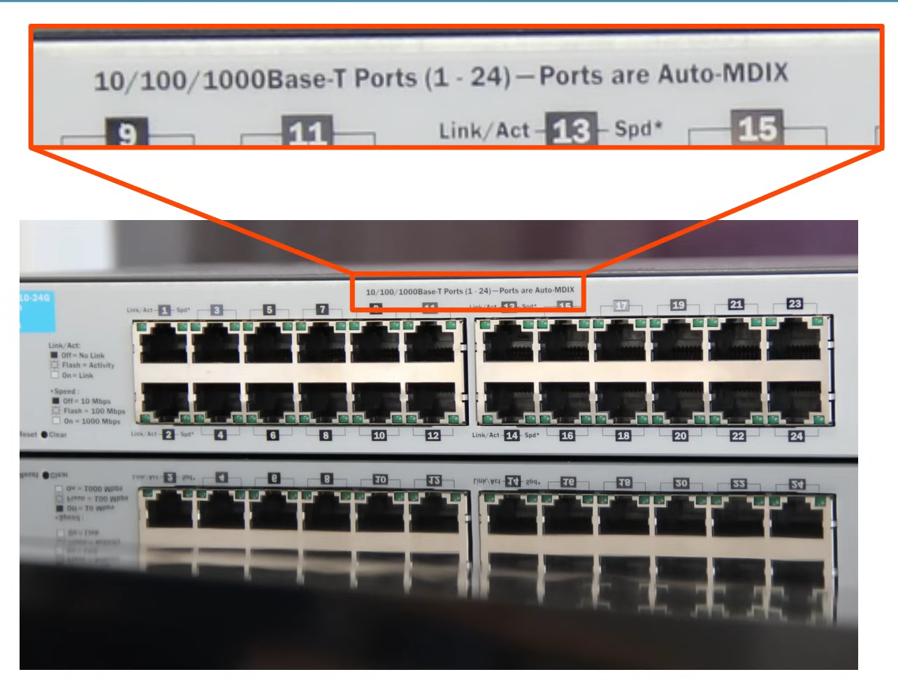

# Day 02 (Interfaces and Cables)

In front of a switch these are known as RJ45 Ports

RJ = Registered Jack

Analyze that shape it could be similar by RJ45 connector.

There connector will be a different color still these connector can be set on that switch port.

- RJ45 used on the end of Copper Ethernet Cable

---

## Ethernet

- Ethernet is a collection of network protocols/standards. which also named as !EEE 802.3 Standard

Why do we need network protocols and standards?

- provide common communication standards over networks.
- provide common hardware standards to allow connectivity between devices.

- Protocol defined according the IEEE 802.3 standard in 1983
- IEEE = Institute of Electrical and Electronic Engineers.

---

## Table of IEEE standards for Copper Ethernet Cables.

This column is for common cable speed we know

This column is name of different network interfaces, cables in work environment

Officially IEEE standard name which should familiar with them.

Informal name which first number refers their speed but
  • Base = Baseband Signaling
  • T = Twister pair

There’s is maximum length of twisted pair cables of ethernet based on performance and technical reasons.

---

## Bits and Bytes

- Connections between devices in a network operate at a set speed. These speed are measured in bits per seconds.

**What is bit?**

- Bit is a value which represents by 0 and 1 (Binary).

- Data transmit Speed measured in every Bit per Seconds (Kbps, Mbps, Gbps, etc).
- Not Byte per Second.

> Gigabyte is 8th time larger then Gigabit.
> 

| 1 kilobit (kb) | 1,000 bits | if add there zero extra, it will Megabits. |
| --- | --- | --- |
| 1 megabit (mb) |  1,000,000 bits | if add there zero extra, it will Gigabits. |
| 1 Gigabit (Gb) | 1,000,000,000 bits | if add there zero extra, it will Terabits. |

---

## UTP Cables

- U = Unshielded (Unshielded means the wire doesn’t have any metallic shield.)
- T = Twisted (Pairs of Cables twisted togather)
    
    
    
    The twist actually helps to protect against Electromagnetic Interference (EMI).
    
    So there 4 pairs of wires makes 8 wires together.
    
    
    
    In here there is 8 pins for 8 wires.
    
    
    
    There are 8 Pins or 4 Pairs in UTP copper cable,
    
    - 10BASE-T and 100BASE-T (Slow/Medium Speed) —> 2 wire uses
    - 1000BASE-T এবং 10GBASE-T (High Speed) —> 4 wire uses

---

## Connecting PC to a Switch using Fast Ethernet Connection

Cut a UTP cable using Wire Stripping Tool then untwist wires. sort them as according to **T-568B standard.**

| Orange-White | Pin-1 |
| --- | --- |
| Orange | Pin-2 |
| White-Green | Pin-3 |
| Blue | Pin-4 |
| White-Blue | Pin-5 |
| Green | Pin-6 |
| White-Brown | Pin-7 |
| Brown | Pin-8 |
- Tx means Transmit Data
- Rx means Receive Data

---

- PCs Transmit(TX) data on Pins (1-2)
- Switches Receive(RX) data on Pins (1-2)
- PCs Receive(RC) data on Pins (3,6)
- Switches Transmit(TX) data on Pins (3,6)

There are two types of Ports into Networks

| **MDI (Medium Dependent Interface)** | **MDI-X (Medium Dependent Interface - Crossover)** |
| --- | --- |
| • Pin 1,2 (Transmit) = Tx (this pin transfer data)
• Pin 3,6 (Receive) = Rx (this pin receives data) | • Pin 3, 6 = **Transmit (Tx)**
• Pin 1, 2 = **Receive (Rx)** |
| These kinds of Ports always uses PC, Router, Servers | These kind of Ports always uses on Switch and Hub. |
| PCs Transmit(TX) data on Pins (1-2) | Switches Receive(RX) data on Pins (1-2) |
| PCs Receive(RX) data on Pins (3,6) | Switches Transmit(TX) data on Pins (3,6) |

---

## What if when Router and Switch connects.

| **MDI (Medium Dependent Interface)** | **MDI-X (Medium Dependent Interface - Crossover)** |
| --- | --- |
| • Pin 1,2 (Transmit) = Tx (this pin transfer data)
• Pin 3,6 (Receive) = Rx (this pin receives data) | • Pin 3, 6 = **Transmit (Tx)**
• Pin 1, 2 = **Receive (Rx)** |
| These kinds of Ports always uses PC, Router, Servers | These kind of Ports always uses on Switch and Hub. |
| Router Transmit(TX) data on Pins (1-2) | Switches Receive(RX) data on Pins (1-2) |
| Router Receive(RX) data on Pins (3,6) | Switches Transmit(TX) data on Pins (3,6) |

> Routers and PCs connect the same way with Switches.
> 

### For two different device **Straight Through Cable** will use.

---

## When Similar devices

- PC ↔ PC
- Switch ↔ Switch
- Router ↔ Router
- Hub ↔ Hub

Then Crossover Cable. This cable swaps the pins on one end to allow connection to work.

### For two different device will use Crossover Cable.

---

| **DEVICE TYPE** | **TRANSMIT (TX) PINS** | **RECEIVE (RX) PINS** |
| --- | --- | --- |
| ROUTER | 1 and 2 | 3 and 6 |
| FIREWALL | 1 and 2 | 3 and 6 |
| PC | 1 and 2 | 3 and 6 |
| SWITCH | 3 and 6 | 1 and 2 |

Most modern Devices now has AUTO MDI-X which automatically detects which pins their neighbor is transmitting on and adjust the pins they receive data on.

---

## Fiber Optic

### Why SPF?

SPF allows fiber-optic cables to connect to switches/routers.

- SPF = Small Form-Factor Pluggable.
- Basically RJ45 Copper Cable port doesn’t gives many coverage (Under 100 Meters)

SFP module connects router/switch to Fiber optic ports which can cover a large distance with High Speed capability.

Rather than electrical signal over copper wiring these cable sends light over glass fiber
Fiber have separate cables to transmit / receive.

---

1. One for Transmit Data
2. One for Receiving Data

- In UTP cable there is one cable which can Transmit (Tx) or Receive (Rx).
- Fibre cable need two separate wire for one Transfer and one Receive.

## Structure of Fiber Cable

1. Fiber Core:
    - like the thinnest glass thread in the middle.
    - This is actually the path through which light travels to transmit data.
    - This is the most important part of the fiber; everything else surrounds and protects it.
2. Cladding (Reflects Light):
    - a second layer surrounding the core.
    - reflect the light and direct it back into the core.
    - the light cannot escape the core; instead, it travels by repeatedly reflecting within it, this is how the signal remains intact over long distances.
3. Protective Buffer:
    - a protective layer.
    - protects the inner glass core and cladding from external impact, pressure, or breakage
4. Outer Jacket of Cable:
    - Outer, the thickest and hardest Layer.
    - protects the entire cable from water, dust, impact, and other external damage.
    - This is what we hold or look at from the outside.

> **Core → Cladding → Buffer → Jacket**
> 

---

## Types of Fiber

In the picture below Center represents the fiber glass core and blue represents the reflecting cladding.

- **Single Mode**
    
    
    
    - Only straight flow of light.
    - Doesn’t bounce light.
    - Laser based transmit.
    - Less Signal loss.
    - Yellow Color cable jacket
    - uses for High Distance (One City to another city or ISP backbone network or Undersea).
    - High Cost (expensive laser-based SFP transmitters).
- **Multi Mode**
    
    
    
    - Allow light waves or light bounce.
    - Less powerful leaser.
    - Cost cheaper LED-based or less powerful leaser based SFP transmitter.
    - Cable Jacket color could be Orange or Aqua.
    - Not recommended for long distances (Same building or Inside of Datacenters).

## Standards of Fiber Optic Cables

- This IEEE Standard 802.3z can be used as Single mode or Multimode
- Speed 1 gigbits per second
- Maximum cable length
    - For 550 meters for MultiMode
    - For 5 kilometers for SingleMode

- This IEEE Standard 802.3ae can be used as Multimode.
- Speed 10 gigbits per second
- Maximum Cable length 400 Meters only

- This IEEE Standard 802.3ae can be used as Single Mode only.
- Speed 10 gigbits per second
- Maximum Cable length 10 kilometers only.

- This IEEE Standard 802.3ae can be used as Single Mode only.
- Speed 10 gigbits per second
- Maximum Cable length 30 kilometers only.

---

## Difference Between UTP and Fiber Optic

| UTP | Fiber Optic |
| --- | --- |
| Lower cost than fiber-optic. | Higher cost than UTP. |
| Shorter Maximum Distance then fiber optic (100m) | Longer maximum distance than UTP. |
| Vulnerable to EMI (Electromagnetic Interference) | No vulnerability to EMI. |
| RJ45 ports used with UTP are cheaper than SFP ports. | SFP ports are more expensive than RJ45 ports (single-mode is more expensive than multimode). |
| Emit (Leak) small signal outside of cable, which can be copied (security risk like eavesdropping). | Does not emit any signal outside of the cable (no security risk). |
