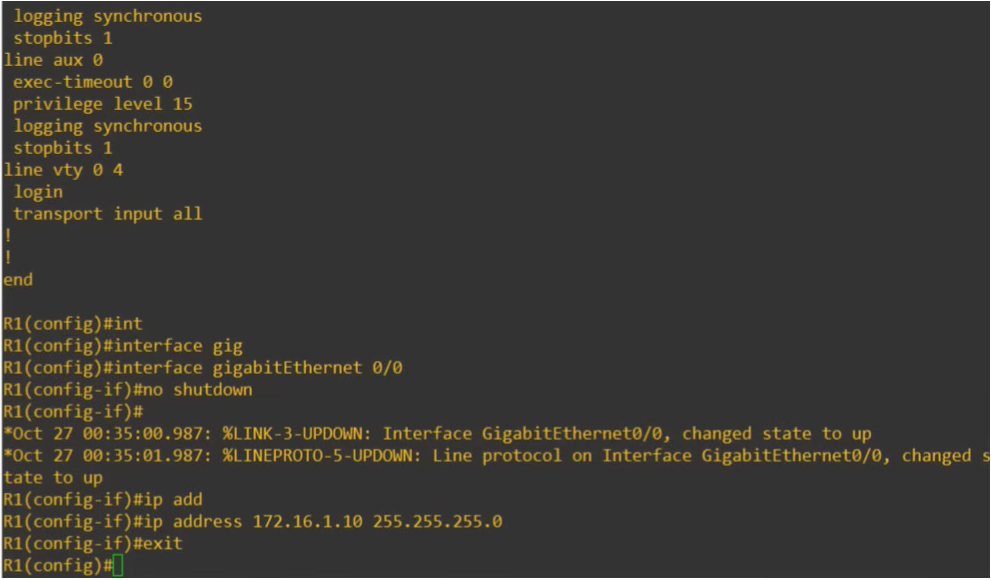

# Day 04 (Intro to the CLI)

[Free CCNA | Intro to the CLI | Day 4 | CCNA 200-301 Complete Course](https://youtu.be/IYbtai7Nu2g?si=rW_5ApoBALAXxZvf)

> Cisco IOS is an Operating system uses cisco devices
> 
- GUI = Graphical User Interface
    
    
    
- CLI = Command Line Interface
    
    
    

> Most network engineer prefer to use CLI over GUI.
> 

---

## Connecting Cisco Device

> Q: How do you connect cisco devices?
Ans: Console Port

When you first configure a device (e.g., Switch), you have to connect via the Console Port.
Another way their exist like Remote connection.
> 

Rollover cable is a specialized networking cable, which primarily used to connect a computer or laptop to router or switch to the console or configuration port for make any configuration (such as Cisco devices).


This is the image of Cisco Catalyst Switch.
There are two console ports.
  1. USB Mini-B
  2.  RJ45 (just like switches network ports

This is the image of Cisco Catalyst Switch. 
There are two console ports.
  1. USB Mini-B
  2.  RJ45 (just like switches network ports)

---

### RJ45 console port and Rollover cable


This is the kind of cable will use were 

- 1 end is RJ45 connector (Just like ethernet UTP cable)
- Other end is DB9 connector.

Most laptop these days no longer have serial port to plug the cable. Need an adapter to connect USB port on Laptop


### Crossover Cable as similar like Ethernet UTP cable

- there are 8 pins on each end that are used


| Pin1 —> Pin8 |
| --- |
| Pin2 —> Pin7 |
| Pin3 —> Pin6 |
| Pin4 —> Pin5 |
| Pin5 —> Pin4 |
| Pin6 —> Pin3 |
| Pin7 —> Pin2 |
| Pin8 —> Pin1 |

> Q: Once you connected to the computer on your device so how do you actually access the CLI?

Ans: Need an terminal emulator like [PuTTy](https://putty.org/index.html).
> 

After make connection device to laptop using rollover cable, 

1. Open PuTTy, select serial, then Open.
    
    
    
    You should able to connect with default settings but click serial down here, you can view or edit for default connection of serial.
    
    
    
    This is by default on Cisco Devices so probably not have to change them but it’s good to were of them and try to remember them.
    
2. Speed also known as baud rate is 9600 per seconds.
    
    
    
    also,
    
    - there are 8 data bits
    - 1 stop bit
    
    Each 8 bits of data one stop bit is sent, to mark the end of the 8
    
    - Parity is set to none
    
    Parity is used to detect error.
    
    - flow control is set to none.
    
    Flow control is exactly what is sounds like, Controlling flow of the data from transmitter to receiver.
    
    > understanding this option is good cause this is Cisco’s default but not for CCNA exam.
    > 

---

## Mode


This is the interface of first time booting up to device.

### USER EXEC mode

- `Router>`  —> This called USER EXEC mode (indicating by grater than sign beside of hostname)
    
    
    
    - USER EXEC mode is very limited
    - This mode is can look at something, but can’t make any changes to the configuration
    - also might called “user mode”

### Privilege EXEC mode

By typing `enable` command on USER EXEC mode, user switches PRIVILEGE EXEC mode.

- `Router#` —> This is called Privilege EXEC mode (Indicating by Hash symbol sign beside of hostname)
    
    
    
    - Provides complete access to view the device’s configuration, restart the device, etc.
    - Can not change the configuration, but can change the time on the device, save the configuration file, etc.

---

- `Router> ?`  —> view the available commands according to mode purpose
- `Router> e?` —> beside an ? mark of any letter or character, shows available commands according to character.
    
    
    
    You can use shortcut for command as pressing tab
    
    
    

---

### Global Configuration Mode

By typing `configure terminal` command on PRIVILEGE EXEC mode, user switches to Global Configuration mode.


```bash
Router> e?
enable exit
Router> en
Router# con?
configure connect
Router# conf t?
terminal
Router# conf t
Enter configuration commands, one per line. End with CNTL+Z
Router(Config)#
```

If you want to go for shortcut, you can also go for there.

> `exit` —> This command is for exiting current mode to previous mode.
> 

---

## Enable Password

As we saw we can mode by typing command which is very less secure and anyone can be make any configuration changes, so we need to enable password to protect PRIVILEGE EXEC mode. Cause without PRIVILEGE EXEC mode user can not switch directly to Configure Terminal mode.

```bash
Router(config)#enable password?
password
```

```bash
Router(config)#enable password ?
7	      Specifies a HIDDEN password will follow
LINE    The UNENCRYPTED (cleartext) 'enable' password
LEVEL   Set exec level password
Router(config)#enable password 567123 ?
  <cr>
```

<cr> means there are no further options available for this

```bash
Router(config)#enable password 567123
```

Password will saved and if used exit from Configure Terminal mode and Privilege exec mode then whenever user will try to switch USER EXEC mode to Privilege then terminal will ask for entering the password.


- password not will display as you type it (for security purpose)
- If type wrong passwords for three times then it will denied access for having “bad secrets” which is known as Incorrect password.
    
    
    

> Password is CASE-Sensitive
> 

---

### Review it once again


---

## Running config / startup-config

There are two separate configuration files kept on the device at once. 

1. Running-config = the current, active configuration file on the device. As you enter commands in the CLI, you will edit active configuration
    
    For showing running config’s
    
    
    
2. Startup-config = the configuration file that will be loaded upon restart the device.
    
    
    
    > Every time when user rebooted the device, it will load as default configuration. Not a start-up configuration. Default configuration’s will shown as by typing command `show startup-config`.
    > 
    
    ---
    

There actually three way’s you can save the running configuration’s to make it as startup configuration’s

1. `Router# write`
    
    
    
2. `Router# write memory`
    
    
    
3. `Router# copy running-config startup-config`
    
    
    

These three of commands executed from privilege exec mode. These three commands performs same function.

As typing `show startup-config`, then here will show same as output like `show running-config`. 


But one thing is here the password is undecrypted.

So we need to encrypt that password by entering Global Configuration mode and typing command `service password-encryption`. 


This password is CCNA but only displaying configuration has changed just. But one thing notice that 7 is beside that password.

This number 7 indicates the encryption type used for encrypt the password

- 7 means Cisco proprietary encryption algorithm

While this is less secure algorithm. 

To secure more strong method is better to use, `enable secret` 


then, `do sh run` or `do show running-config`

Basically show is Privilege exec mode command but while configure something into configuration mode use `do` to show command output without switching mode.


- 5 means MD5 encryption

> If both command used, enable password or enable secret then enable password will ignored and not will effect to enable secret command.
> 

---

## Canceling Command

while you want to cancel those service running, type no beside of command.

As like if you type `no service password-encryption` 

---

## Summarize this service password encryption command

If enable `service password-encryption`

- current passwords will be encrypted
- future passwords will be encrypted
- enable secrets will not be effected

If disable `service password-encryption`

- current passwords will not be decrypted
- future passwords will not be encrypted
- the enable secrets will not be effected

---

## Review It overall

### modes review


### commands review


### Commands to save current-running configuration and make startup configuration


---

## Quiz

**Question 1:**


| Pin1 —> Pin8 |
| --- |
| Pin2 —> Pin7 |
| Pin3 —> Pin6 |
| Pin4 —> Pin5 |
| Pin5 —> Pin4 |
| Pin6 —> Pin3 |
| Pin7 —> Pin2 |
| Pin8 —> Pin1 |

**Question 2:**


Question 3:


**Question 4:**


> enable secret always takes the priority of enable password. And never be asked to enter both passwords. you must enter only enable secret only
> 

**Question 5:**


---
