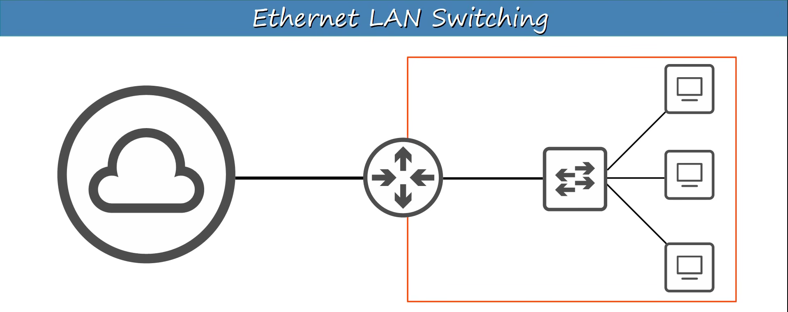

# Day 05

# Ethernet LAN switching

In here will see how data moves around between the switches and the end hosts connected to them, and to their router (not router to other networks)

---

## OSI Model (Review)

### Physical Layer

### Data Link Layer

> Layer 2 addressing (MAC addressing)
> 

> Ethernet Involves Layer1 (Physical Layer) and Layer2 (Datalink layer)
> 

> Layer-1 Ethernet standards like UTP cables are already covered at [Day-02](https://app.notion.com/p/Day-02-Interfaces-and-Cables-3b8fbfa22d598014a9bdf6c716e39078?pvs=21)
> 

---

## What is LAN is?

LAN stands for **Local Area Network**, which is a group of computers and connected devices linked together in a small area like a home, school, or office building

Routers are used to connect separate LAN’s 

Switches do not separate LAN’s. Adding more switches can be expand to existing LAN but if multiple switches are connected with each other it will a large LAN (2) or if switches are not connected to each other then different LAN under a router (3).

---

## Review it once again

- Data prepare by Upper layer of the OSI model
- combination of Layer 4 header and Data is called Segment
- Layer3 header is added to segment and it’s called packet
- Finally two layer Header and trailer added to the packet it becomes the Frame.
- Different stages of data to forwarded are called PDU.
    - Layer 4 PDU is Segment/Datagram
    - Layer 3 PDU is Packet
    - Layer 2 PDU is Frame

> Switches receives and forward frames, cause it’s the Layer 2 protocol used in virtually every LAN in existence today.
> 

---

# Ethernet Frame

Ethernet Frame is an datalink layer (Layer 2) concept. 

Ethernet Frame encapsulating the packet with Header and Trailer.

---

## Ethernet Header

In the header part there are 5 fields.

These are used for synchronization and to allow the receiving device to be prepared to receive the rest of the data in the frame. 

---

### Preamble

Premable is a section located at the very beginning of an Ethernet frame, the primary function of which is to prepare the receiving device to accept data.

Preamble’s total,

- Length: 7th bytes (56 bit)
- Series of Alternating 1’s and 0’s (10101010 * 7)
- 8 bit (10101010) pattern repeated by 7 = total 56 bit.
- Clock Synchronization : allow synchronizing the clocks or timing between the sending device (sender) and the receiving device (receiver).

---

### SFD

This is a small section of an Ethernet frame located immediately after the preamble, which essentially acts as a "signal.”

- SFD = Start Frame Delimiter
- Length: 1 byte (8 bits, 10101011)
- (10101011) Upon seeing this final "11" (two consecutive 1s), the receiver device realizes that the preamble has ended and the actual frame data (Destination Address) is beginning.

---

### Destination and Source

This section Indicates the device source and  destination MAC (Media Access Control)

Media Access Control or MAC hardware address of 6 bytes or 48 bits of physical device and it is assigned to the device when it was made by the company.

---

### Type/Length

This part represents inside what kind of data it could be and how to process with that. It could be IPv4 or IPv6.

IPv4/IPv6 is layer 3 packet which encapsulated within a Layer 2 frame for transmission.

When data is transmitted over a network, an IPv4 or IPv6 packet is created at Layer 3 (Network Layer). When this packet reaches the next lower layer named Layer 2 (Data Link Layer)—the Ethernet protocol accepts the entire IP packet with data named Payload. Ethernet then attaches a header to the front and a trailer to the back of this Payload, transforming the entire payload into an Ethernet frame.

In the header part of Ether Frame, Type/Length section gives information about that data which are came from network layer is IPv4 or IPv6? It does not give the length of IPv4 or IPv6, just gives the information that the data is whom for!

In an Ethernet frame header, "Length" refers to the total size in bytes of the actual data (payload) contained within the Ethernet frame.

In the Ethernet Frame Maximum Transmission Unit is 1500 bytes

2 bytes is Header Type/Length its own size allocated in header

1500 is the size of data inside to Frame which also we know actual Data/Segment/Packet maximum size.

In the inside of Type/Length value

- 1500 is the maximum size of Data/Segment/Packet inside of Frame. The size it could be same or less.
- But if the value is greater than 1500 is could be protocol ID.
    - If code is 0x0800 (2048) —> IPv4
    - If code is 0x86DD (34525) —> IPv6

---

## Ethernet Trailer

### FCS

Stands for Frame Check Sequence

- 4 bytes (32 bit) length
- When the receiver device receives a frame, a 'CRC' algorithm is executed in this section to check whether any data within the frame has been lost or corrupted.
- CRC = Cyclic Redundancy Check

---

## Ethernet Header and Trailer total Bytes

| Preamble | 7 |
| --- | --- |
| SFD | 1 |
| Destination | 6 (MAC Address) |
| Source | 6 (MAC Address) |
| Type | 2 |
| FCS | 4 |
| total =  | 26 bytes (Only header+trailer) |

---

## MAC address

Stands for Media Access Control

It is a physical address assigned when it is made.

It is also known as Burned In Address (BIA) cause it is burned physically to hardware side when it was made.

It is globally unique and I device have two MAC address means it have to Network Interface Card (NIC). Each NIC have unique as globally or locally.

In the case of 6 bytes, First 3 bytes are OUI (Organizationally Unique Identifier), this represents to the company who made that Device. Each company have his own OUI (Cisco have his own OUI and IBM also have his own OUI) and Last 3 bytes indicates that device itself. 

6 byte address are the series of Hexadecimal numbers which separated by colon notation.

- Decimal = 10 Possible Digits (0,1,2,3,4,5,6,7,8,9)
- Hexadecimal = 16 Possible Digits (0,1,2,3,4,5,6,7,8,9,A,B,C,D,E,F
    
    
    

- Decimal 0 is HEX 0
- Decimal 10 is HEX A
- Decimal 16 is HEX 10
- Decimal 26 is HEX 1A

This just general understanding but in the case of IPv6 it have to understand more precisely. 

---

F0/1, F0/2, F0/3…….. 

F means Fast Ethernet, these are Fast Ethernet means 100 megabits per second. 

Device connections:

- PC1 (MAC: AAAA.AA00.0001) is connected to port F0/1 of switch SW1.
- PC2 (MAC: AAAA.AA00.0002) is connected to port F0/2 of switch SW1.
- PC3 (MAC: AAAA.AA00.0003) is connected to port F0/3 of switch SW1.

A switch has an internal table that stores the ports associated with learned MAC addresses. Here, the switch's table already contains the following information:

| MAC | Interface |
| --- | --- |
| .0001 | F0/1 |
| .0002 | F0/2 |

When the Frame comes to switch from like PC1 to SW1 through port F0/1, switch analyze that MAC address of Source and Destination and try to examine them by saving into its memory called MAC table.

This table’s MAC addresses also called Dynamic MAC Addresses cause these MAC address doesn’t configured by itself. 

- If that destination MAC is exist on it’s MAC table then switch forward packet directly to destination to known port. (Unicast Frame Forwarding or One-to-One Communication)
- If that destination is not exist then switch forward that packet to every port except the incoming port where the data is came from. This also called as Port Flooding or Unicast Frame Flooding. (Unknown Unicast Frame Forwarding or One-to-All Communication)

MAC address table are dynamic, It could be refresh everytime and can be remove that table data.

---

Lets suppose,

- PC1 is source (MAC= AAAA.AA00.00001) sending a Frame to PC3 Destination (MAC=AAAA.AA00.0003)

So when PC1 sends a packet to it’s network interface, it arrives to SW1

Switch 1 learned PC1’s MAC address from source address field of the frame and also the port where Frame is came from.

> This learning is dynamic and or Dynamic MAC Address (DIA), because this is not configured manually and it could be remove automatically at specific time or when the switch is need.
> 

But the Switch 1 still doesn’t know where the PC3 is. 

Switch will forward that packet with Unknown Unicast Frame which also named as Flooding except the source Interface where it came from.

But what will SW2 or Switch 2 do?

It will also do the same thing what SW1 did.

in SW2 MAC table it will enter Source MAC and Interface where Frame is came from (F0/3). 

For SW1, PC1 is directly connected to port F0/1. However, for SW2, PC1 is located beyond port F0/3 (which connects to SW1). Therefore, SW2 has correctly determined that to reach PC1, it must send data to port F0/3.

But at this step also how SW2 will reach to PC3 cause it doesn’t have any information in MAC table.

So switch it floods it all interfaces except the one it was received on. 

F0/3 won’t be flooded and sent all other interfaces like F0/1 and F0/2. On F0/2 port PC4 will drop that packet by analyzing the Destination MAC which doesn’t match it’s own . But on F0/1 port PC3 will receive that frame by analyzing that Destination MAC cause it matches with it’s own.

At this point will response also sent from PC3 and the hole process will go with reverse.

At this point,

When the frame originating from PC3 enters port F0/1 of SW2, SW2 immediately identifies the frame's source MAC (.0003) and records it in its table. 

| .0003 | F0/1 |
| --- | --- |

In the previous step, when PC1 sent a frame, SW2 saved the information in its table that .0001 is located on port F0/3.

Therefore, as soon as PC3's return frame (Dest: .0001) is received, SW2 checks its table and recognizes the address; consequently, instead of flooding it, the switch forwards it directly to port F0/3 to SW1. And SW1 also does that same thing and it also forward the Frame to PC1 instead of flooding it.

---

## Quiz

**Question: 1**

---

**Question: 2**

---

**Question: 3**

---

**Question: 4**

---

**Question 5:**

---