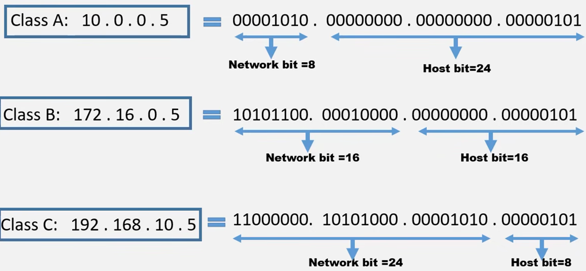
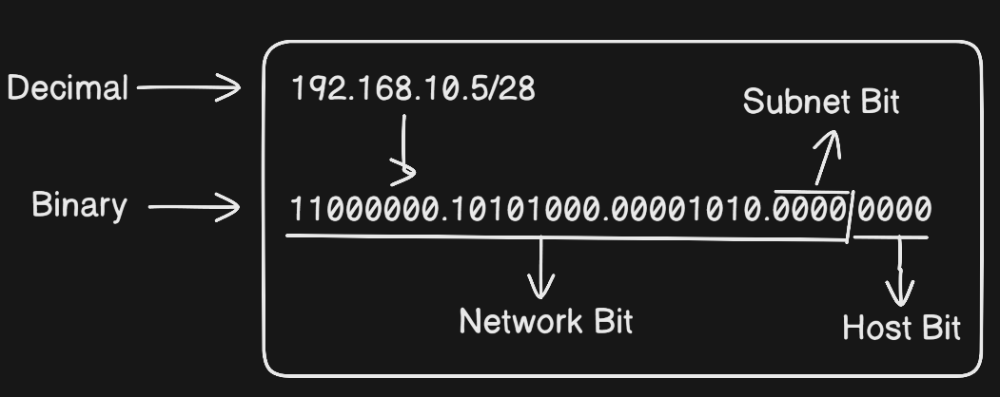

# Subnetting Concept
[video link](https://youtu.be/BMhPOGnckeg?si=qOBId6jkgPFSIBEo)
## A Given IP address (192.168.10.5/28)

**Question** is:

- What is network address?
- What is broadcast address?
- What is first valid host?
- What is last valid host?
- What is subnet mask?
- What is block size/host per subnet?
- what is number of subnet?
- what is number of valid host?

---

## Understand basic terms first.

> Before solving, remember this image concept always (This is private IP range)
> 
> 
> 
> 

> `/digit` indicates to always network portions bit number or how many fixed bit in network portion. This slash also called CIDR range. If only IP given and doesn't have any CIDR(Classless) or slash, that mean that is Classful which is normally we saw IP classes.
> 

Class C :
Network bit : `11111111.11111111.11111111` --> `/24`

(total 24 bits of network portion which is fixed.

Host bit : `.00000000` ( This host portion is for work)

> Network portion is not for subnetting, Host portion is for subnetting.
> 

So,

`192.168.10.5/28`

`11111111.11111111.11111111.11110000` --> 24+4 = `/28`

---

## Q1: What is network bit?

> For getting network address, first need to convert IP decimal to binary.
> 

> For getting Network address = All **Network bit including subnet bit as it** is and **all Host bit is `0`**
> 

#### Ans: Network Address = 192.168.10.0

---

## Q2: What is Broadcast Address?

> For getting Broadcast address = All **Network bit including Subnet bit** as it is and all **Host bit is 1**.
> 

> remember a Formula : **`128,64,32,16,8,4,2,1`**
Every octet of Binary to Decimal or Decimal to Binary conversion should use this formula.
> 

> `192.168.10.15` is the Broadcast address.
Solution : Formulas last Digits or Host Bit part are `8, 4, 2, 1` and `15` is equation of them.
> 

#### Ans: Broadcast address 192.168.10.15

---

## Q3: What is the first valid host?

Before finding the valid host, should understand the subnet architecture

192.168.10.0 - 192.168.10.15 —> There is total 16 IP address

- `192.168.10.0` —> Network Address
- `192.168.10.15` —> Broadcast Address

So, first valid host is below IP address of Network Address (192.168.10.1)

#### Ans: First Valid Host: 192.168.10.1

---

## Q4: What is the last valid host?

According to previous concept of Subnet diagram, the Last valid host is over of Broadcast address.

- 192.168.10.0 —> Network Address
- !92.168.10.15 —> Broadcast Address

Last valid host is `192.168.10.14` 

#### Ans: Last valid host: 192.168.10.14

---

## Q5: What is subnet mask?

> The formula of getting subnet mask = subnet Bit all 1 and Host bit 0
> 

> Also remember this formula —> **128,64,32,16,8,4,2,1**
> 
- Network —> 192.168.10.5/28
- Bit —> 11111111.11111111.11111111.11110000

- Subnet Mask —> 255.255.255.240

#### Ans: Subnet Mask —> 255.255.255.240

---

## Q6: What is Block Size or Host per subnet?

- Default mask —> 255.255.255.255
- Identified Subnet mask —> 255.255.255.240
- Block Size = 256-240 = 15 (0-255 = 256)

---

## Q7: What is number of Subnet?

- Subnet mask —> 255.255.255.240
- Convert Binary —> 11111111.11111111.11111111.11110000

> Formula of getting subnet is 2^x (x is for total subnet bit)
> 

Number of Subnet = 2^x = 2^4 = 16.

| First Subnet | 192.168.10.0 — 192.168.10.15 |
| --- | --- |
| Second Subnet | 192.168.10.16 — 192.168.10.31 |
| Third Subnet | 192.168.10.32 — 192.168.10.47 |

This way it will go for 16 subnets.

#### Ans: Number of Subnet = 16

---

## Q8: What is number of total valid hosts?

> The formula have to remember that, 2^y -2 (y is number of 0 or host bit and -2 for Net ID and Broadcast ID)
> 
- Number of Host = 2^4 -2 = 14

#### Ans: Number of valid host: 14

---
